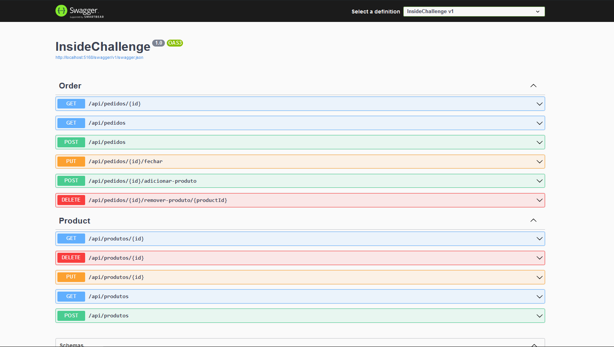
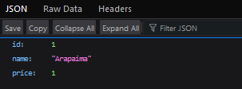
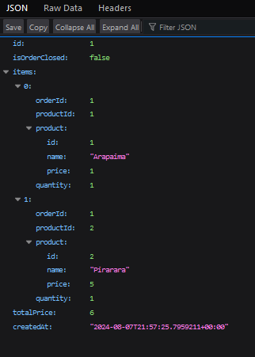
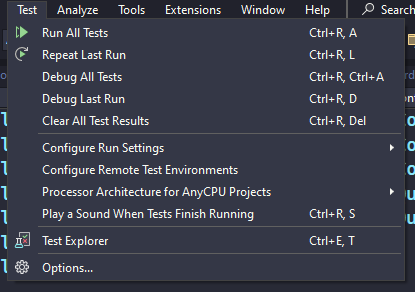

# InsideChallenge
## Preface
Este projeto foi criado em .NET 8, utilizando Visual Studio e VSCode para escrever o código.

Busquei um equilíbrio entre brevidade e precisão técnica neste teste, e espero ter demonstrado isso bem através da minha implementação da arquitetura e uso de pacotes como o Mediatr.

Reconheço que existem várias áreas do código que poderiam ser melhoradas, mas acredito que o que eu escrevi aqui seja suficiente para demonstrar pelo menos parte da minha habilidade com C# e .NET.
 ## Setup
 Primeiramente, navegue até a pasta da API (InsideChallenge) e rode o comando `dotnet restore`
 
 Após isso, rode `dotnet ef database update`. Isso irá baixar os pacotes do NuGet necessários e criar a base de dados SQLite do projeto.

Para executar o projeto, basta rodar `dotnet run` no seu terminal ou simplesmente usar o Visual Studio.

 ## Rotas
O projeto vem com a configuração padrão de um novo projeto criado através do Visual Studio, então as rotas deveriam parecer familiares.

Exemplos:

 http://localhost:5168/swagger/index.html -> Rota HTTP para a interface do Swagger

 

 http://localhost:5168/api/produtos/1 -> Rota HTTP para acessar o controller de produtos e ver o produto com ID 1.

 

 http://localhost:5168/api/pedidos/1 -> Rota HTTP para acessar o controller de pedidos e ver o pedido com ID 1.

 

Eu entendo que o desafio pedia somente para entregar rotas relacionadas aos pedidos, porém, imaginei que poder visualizar e criar/deletar/editar tanto pedidos quanto produtos no mesmo lugar através do Swagger tornaria a correção deste teste mais cômoda.

A configuração de rotas se encontra em `properties\launchSettings.json`

## Testes unitários
Você pode facilmente rodar os testes com `dotnet test` na pasta do projeto de testes  do XUnit, ou pelo próprio Visual Studio.

Eu reconheço que de maneira alguma testar apenas a inicialização e as funcionalidades base de uma entidade sejam o suficiente para considerar uma aplicação testada, mas eu imaginei que para os propósitos deste teste já estava de bom tamanho.

 ## O que ainda há a melhorar e meus arrependimentos com este projeto
Antes de qualquer coisa, ter certeza de que as propriedades certas são anuláveis, e que os controllers e queries saibam como lidar com esse tipo de situação (principalmente lançando exceções). Um middleware para lidar com esse tipo de erro provavelmente seria uma boa.

Ter DTOs mais limpos, mais granulares e que exponham somente o que é absolutamente necessário para o cliente.

Utilizar os métodos do controller `APIController.cs` de maneira correta para lidar com erros e outros problemas de validação. Imaginei que isso iria adicionar muito bloat desnecessário para um teste técnico, mas resolvi deixar o código ali para mostrar que tinha intenções de utilizar ele.

Escrever MUITOS mais testes. Testes para as outras entidades, DTOs, camadas de acesso ao banco de dados, etc.